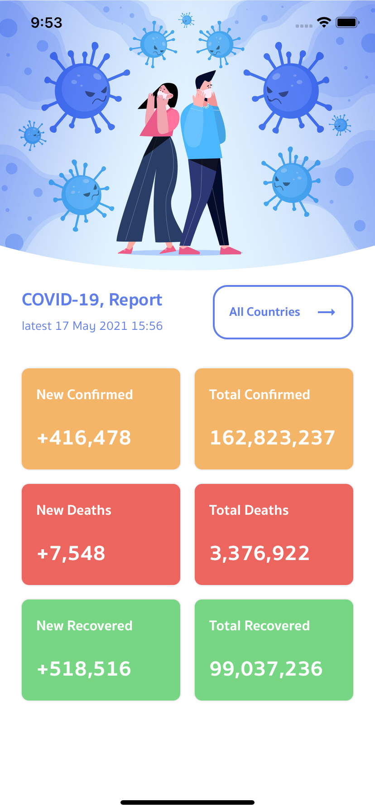
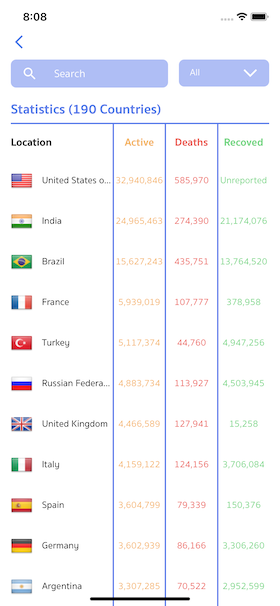

# Covid-19 Report
> Application that get case of Covid-19 in the world

## Getting Started

- [Installing](#installing)
- [Build App](#build-app)
- [Run App](#run-app)
- [Screenshot](#screenshot)

## Installing


### Clone

- clone this project


### Install Node Package

- open terminal/cmd

- go to project folder (/covid_report)

- install node package via

```
npm install
```
```
yarn
```

### Install Pod [IOS]

- go to /covid_report/ios [IOS Steps]

- install pod via [IOS Steps]

```
pod install
```

## Build App


### Build Project in Native IDE

#### Android

- open terminal/cmd

```
npm run android-release
```
```
yarn android-release
```

- the apk (app-release.apk) file inside /android/app/build/outputs/apk/release/ folder

#### IOS

- open XCode, select /covid_report/ios clean and build [IOS Steps]


## Run App

### Run via commands

#### IOS

- run via

```
npm run ios
```
```
yarn ios
```


#### Android

- open emulator / connect device

- check device already connected via

```
adb devices
```

- run via

```
npm run android
```
```
yarn android
```

## Screenshot





